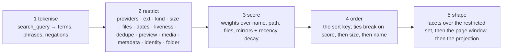

Every request to `GET /internal/api/results.json` passes through five stages in a fixed order. Understanding which stage a parameter belongs to is the fastest way to debug an unexpected result — a filter and a sort answer different questions, and the facets you ask for describe the set after stage 2, before the page window narrows it in stage 5.

## The pipeline at a glance



Groups of parameters combine as AND — every filter must pass. Values inside a single parameter combine as OR. `providers=mega,dropbox&ext=pdf,epub` means: two drives AND two formats — four combinations, one answer.

## Stage 1: Tokenise

The `search_query` parameter (or its alias `q`) drives this stage. The endpoint applies its own tokeniser, documented in *The Query Handbook*, sheet 6. The rules are the same as on the site's own search box:

- **Terms** — space-separated tokens, each matched against name and path
- **Phrases** — double-quoted runs: `"periodic table"` requires the exact phrase
- **Negations** — a leading minus: `-worksheet` excludes rows containing that term
- **OR** — the literal word `OR` between two terms

The `search_query` cap is 200 characters. The `Query` class enforces this before the request goes out and raises `InvalidParameter` with the length if it is exceeded:

```python
from meawfy import Query

# Exact phrase + term
q = Query('"climate report" pdf')

# Negation
q = Query('atlas -worksheet')
```

<Note>
  A space in the query string is encoded as `+` (`quote_plus`), and a literal `+` character is encoded as `%2B`. This is what the endpoint expects (trap 4). The `Query` class handles this automatically.
</Note>

## Stage 2: Restrict

After tokenisation the index applies every filter parameter. These parameters decide **what is in the set**. Passing a filter with no matching rows returns an empty set — not an error.

The filter groups are:

| Group | Parameters |
|---|---|
| **Drive** | `providers`, `provider`, `source_domain` |
| **Material** | `ext`, `exclude_ext`, `license`, `kind`, `min_size`, `max_size`, `size_bucket`, `min_files`, `max_files` |
| **Time & health** | `after`, `before`, `checked_after`, `alive`, `dedupe`, `min_mirrors` |
| **Preview & media** | `preview`, `has_preview`, `preview_size`, `resolution`, `duration`, `page_count` |
| **Content metadata** | `language`, `author`, `tags`, `format` |
| **Provenance & identity** | `id`, `hash`, `created_after`, `created_before` |
| **Folder structure** | `folder_path`, `depth`, `parent` |

Within a single parameter, values are OR'd together. Across parameters, they are AND'd:

```python
from meawfy import MeawfyClient, Query

client = MeawfyClient()

# mega OR dropbox, AND pdf OR epub
query = Query(
    "periodic table",
    providers=["mega", "dropbox"],  # OR within this parameter
    ext=["pdf", "epub"],            # OR within this parameter
    # AND between the two parameters
)
envelope = client.search(query)
```

The `alive` filter defaults to `true`, hiding dead rows. To see recently-dead rows (within the 72-hour grace window), send `alive=false`. After that window the rows are purged and no parameter reaches them.

## Stage 3: Score

Every row that passed stage 2 receives a relevance score between 0 and 1. Scoring runs over four weighted fields: `name`, `path`, `files`, and `mirrors`. A recency decay on `indexed_at` can be applied with the `fresh` weight preset.

Scores are comparable only within a single query. A score of 0.8 from one request says nothing about a score of 0.8 from a different request.

The `weights` parameter controls scoring. It accepts either a named preset or a custom numeric expression:

```python
# Named preset
query = Query("node course", weights="folder")

# Custom weights: name:field=multiplier
query = Query("atlas", weights="name:3,path:1,files:2")
```

### Weight presets

| Preset | Weights | Best for |
|---|---|---|
| `exact` | `name: 3 · path: 1 · phrase required` | A title you already know, where an exact name match matters most |
| `broad` *(default)* | `name: 2 · path: 1 · files: 1` | A phrase you half-remember, across name, path, and collection size |
| `folder` | `files: 3 · path: 2 · name: 1` | Collections rather than individual documents |
| `fresh` | Recency decay on `indexed_at` ×2, everything else halved | What appeared since you last looked |

The `min_score` parameter cuts the tail of low-confidence rows before they reach the page window, but it is `planned`-status — read the echo to confirm it was honoured.

## Stage 4: Order

Stage 4 applies a sort key over the scored set. **This stage decides what you see first, not what is in the set.** The `sort` and `order` parameters live here.

Tie-breaking follows a fixed cascade: `score` → `size_bytes` → `name`. The `sort=relevance` key always sorts best-first and ignores the `order` parameter.

### Sort keys

| Key | Orders by | Default direction | Notes |
|---|---|---|---|
| `relevance` *(default)* | `score` | ↓ descending | Ignores `order`; scores are not comparable across queries |
| `size` | `size_bytes` | ↓ descending | Folders with an unknown total sort last in both directions |
| `files` | `files` | ↓ descending | Meaningless unless `kind=folder` |
| `name` | `name` | ↑ ascending | Case- and accent-insensitive: Ö sorts with O |
| `indexed` | `indexed_at` | ↓ descending | The day the indexer saw the row, not the file's creation date |
| `checked` | `checked_at` | ↓ descending | Liveness checks are scheduled, not on demand |
| `mirrors` | `mirrors` | ↓ descending | Survival signal, not a quality signal |
| `has_preview` | preview present | ↓ descending | Rows with a preview first; `preview=1` must be set for this to mean anything |

`_score` is accepted as an alias for `relevance` by some front-end clients and is normalised internally.

<Warning>
  `sort=size` is not a reliable size sort on folder rows. Folders whose total size the indexer could not determine sort last in both directions. If you want a size sort, add `kind=file` to restrict to file rows only. The `Query` class will warn you via `query.advice` if you send `sort=size` without `kind=file`.
</Warning>

```python
from meawfy import Query

# Sort files by size, largest first
q = Query("documentary", sort="size", order="desc", kind="file")

# Sort folders by number of files, most first
q = Query("node course", sort="files", order="desc", kind="folder")
print(q.advice)  # empty — this combination is correct
```

## Stage 5: Shape

The final stage applies three operations in order: facets, the page window, and field projection.

**Facets** are computed over the full restricted set — after stage 2, before the page window. This means you can send `per_page=1` and the counts in `facets` still describe all matching rows, not just the one you receive.

**The page window** is controlled by `page` and `per_page`. The product `page × per_page` must not exceed 10,000. Above this limit the endpoint keeps answering with the cap applied, so a deeper page is misleading rather than empty. The client raises `DeepPagingError` before the request goes out, and `collect()` stops at the window and sets `truncated=True`.

**Field projection** is controlled by `fields`. A real client renders four or five fields, not all 17. Projecting with `fields=id,name,provider,size,url` reduces the response to roughly a tenth of its full size.

```python
from meawfy import MeawfyClient, Query

client = MeawfyClient()

# Ask for facets and one row — facets cover the whole 1,283-row set
query = Query(
    "periodic table",
    providers="dropbox",
    facets="providers,ext",
    per_page=1,
    fields="id,name,provider,size,url",
)
envelope = client.search(query)

# Facets describe the whole restricted set
print(envelope.provider_counts())  # {'mega': 0, 'dropbox': 471, 'gdrive': 0}
print(envelope.facet("ext"))       # {'pdf': 300, 'epub': 70, ...}

# Only one row came back
print(len(envelope.results))  # 1
```

### Using facets to check whether a filter worked

Facets also tell you whether a filter did anything. If `facets.providers` lists three drives after `providers=dropbox`, the parameter was not honoured — nothing else in the response would have told you.

```python
envelope = client.search("periodic table", providers="dropbox", facets="providers")

counts = envelope.provider_counts()  # always includes all three keys, zeros filled in
# {'mega': 0, 'dropbox': 471, 'gdrive': 0}

if counts["mega"] > 0 or counts["gdrive"] > 0:
    print("providers filter was not honoured — check the echo")
```

The `facet()` method returns any named facet group as a `dict[str, int]`:

```python
envelope.facet("ext")      # {'pdf': 640, 'zip': 233}
envelope.facet("kind")     # {'file': 900, 'folder': 383}
envelope.facet("size")     # {'small': 600, 'medium': 300, ...}
```
